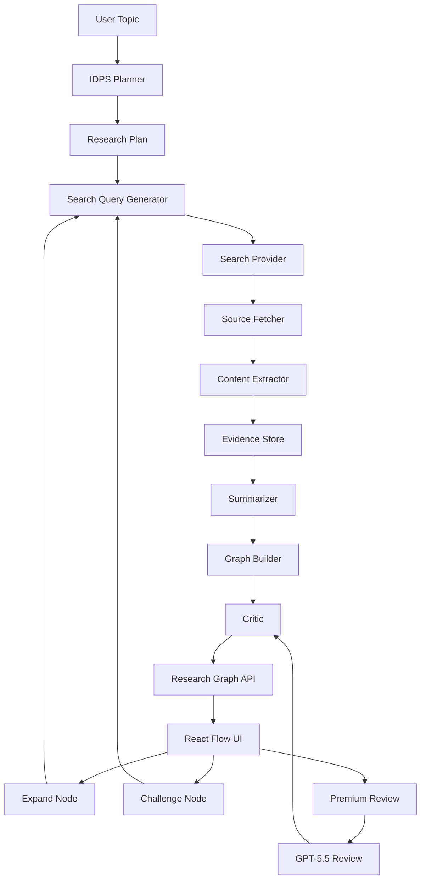

# Research Graph Agent Implementation Brief

Use this document as the build brief for DeepSeek or another coding agent. The goal is to build a practical research/exploration agent: given a vague topic, it creates a sourced topic graph, highlights contradictions and knowledge gaps, and lets the user expand or challenge individual nodes.

## 1. Product Goal

Build a learning tool that helps students (elementary to college) deeply understand any topic they're curious about.

**北极星**：用户输入一个主题，系统不是返回一堆数据，而是返回一条学习路径。每一步都要回答"这个知识点为什么重要"、"怎么理解它"、"有什么有趣的例子"。

The app should support this main workflow:

```text
学生输入想了解的主题
-> 系统判断难度和受众
-> 用学生能理解的语言拆解问题（IDPS）
-> 搜索并过滤适合学生阅读的优质资料
-> 提取关键知识点，标注"为什么重要"
-> 构建学习路径：基础概念 → 深入理解 → 实际应用 → 常见误解
-> 生成图文并茂的学习文章（像课本一样好读）
-> 学生可以追问、展开感兴趣的知识点、做小测验
```

The product should feel like a 学习伴侣 (learning companion), not a research cockpit.

### 1.1 受众分级

不同年龄的学生需要不同的解释方式：

| 级别 | 语言风格 | 示例 |
|---|---|---|
| 小学 | 比喻、故事、图片为主 | "傅里叶变换就像把一首歌拆成一个个音符" |
| 初中 | 直观解释 + 简单公式 | "傅里叶变换告诉我们一个信号里包含哪些频率" |
| 高中+ | 标准学术语言 + 数学推导 | "$$F(\omega) = \int_{-\infty}^{\infty} f(t) e^{-i\omega t} dt$$" |

系统在 IDPS 阶段判断最适合的受众级别，后续所有 prompt 都带上这个设定。

### 1.2 学习路径结构

每个 topic 的输出按学习路径组织，不是平铺数据：

```
1. 这是什么？（一句话概述，用最简单的话说清楚）
2. 为什么重要？（这个东西有什么用，不学会怎样）
3. 核心概念（2-5 个关键知识点，每个带例子）
4. 深入理解（概念之间的关系，图/树展示）
5. 实际应用（现实中的例子，为什么有人关心这个）
6. 常见误解（容易搞错的地方，特别标注）
7. 小测验（3-5 个思考题，帮助巩固）
8. 进一步探索（如果想了解更多，可以看什么）
```

## 2. Recommended Stack

Use this default stack unless the existing project already uses something else:

- Backend: Python 3.11+ with FastAPI
- Agent orchestration: explicit workflow functions first; LangGraph later if needed
- Frontend: Next.js + TypeScript
- Graph UI: React Flow
- Database: SQLite for MVP; Postgres + pgvector later
- Queue: local async tasks for MVP; Redis/RQ or Celery later
- Search provider: pluggable interface; start with Tavily, Brave Search, SerpAPI, or a mock provider
- Page extraction: trafilatura/readability style extraction; Playwright only as fallback
- Bulk model: DeepSeek
- Premium review model: GPT-5.5 or other frontier model, optional and budget-gated

## 3. Core Principle

**Every output must help the student learn, not just inform.**

Build a deterministic learning pipeline:

```text
understand audience -> decompose into learnable chunks -> search kid-friendly sources 
-> extract key ideas with "why it matters" -> build learning path 
-> explain with examples -> test understanding
```

Agentic behavior should appear through controlled learning actions:

- "用更简单的话解释这个"
- "给我一个生活中的例子"
- "这个知识点和我之前学的有什么关系"
- "考考我是不是真的懂了"
- "有没有好玩的冷知识"

**Not just information retrieval — guided discovery.**

## 4. IDPS Integration

Yes, integrate IDPS before topic analysis, but use a lightweight version.

IDPS should be used as a pre-analysis planning gate, not as a long final report. Its job is to improve decomposition quality before the search phase.

### IDPS Pass

Given the user topic, produce:

```json
{
  "problem_restatement": "One sentence describing the real research question.",
  "constraints": ["Fixed or inferred limits."],
  "assumptions": ["Important assumptions that may be false."],
  "dimensions": [
    {
      "name": "Dimension name",
      "description": "What this dimension covers.",
      "subquestions": ["Question 1", "Question 2"],
      "falsification_tests": ["What evidence would weaken this dimension?"]
    }
  ],
  "initial_search_queries": ["Query 1", "Query 2"],
  "risk_flags": ["Known ambiguity, uncertainty, or likely controversy."]
}
```

### Why IDPS Helps

Use IDPS because it forces the agent to:

- restate the real question before searching
- separate assumptions from evidence
- generate better subquestions
- define what would falsify an early conclusion
- avoid premature one-path summaries

### Where IDPS Should Not Be Used

Do not run full IDPS on every node expansion. That will make the tool slow and verbose.

Use full IDPS only for:

- the initial topic decomposition
- high-stakes nodes
- contradictions between sources
- final synthesis
- premium model review

For normal node expansion, use a smaller prompt:

```text
Expand this node into 3-6 subquestions. Identify missing evidence, likely counterarguments, and search queries.
```

## 5. System Architecture



## 6. Data Model

Start with these tables or equivalent ORM models.

### ResearchProject

```ts
type ResearchProject = {
  id: string;
  topic: string;
  status: "draft" | "running" | "complete" | "failed";
  createdAt: string;
  updatedAt: string;
  modelConfig: ModelConfig;
  budget: ResearchBudget;
};
```

### ResearchPlan

```ts
type ResearchPlan = {
  id: string;
  projectId: string;
  problemRestatement: string;
  constraints: string[];
  assumptions: string[];
  dimensions: ResearchDimension[];
  initialSearchQueries: string[];
  riskFlags: string[];
};
```

### Source

```ts
type Source = {
  id: string;
  projectId: string;
  url: string;
  title: string;
  publisher?: string;
  publishedAt?: string;
  fetchedAt: string;
  rawText?: string;
  extractedText: string;
  sourceType: "primary" | "secondary" | "unknown";
  reliabilityScore: number;
};
```

### Evidence

```ts
type Evidence = {
  id: string;
  projectId: string;
  sourceId: string;
  claim: string;
  supportText: string;
  confidence: number;
  tags: string[];
};
```

### GraphNode

```ts
type GraphNode = {
  id: string;
  projectId: string;
  title: string;
  summary: string;
  nodeType: "dimension" | "claim" | "question" | "gap" | "contradiction";
  confidence: number;
  sourceIds: string[];
  evidenceIds: string[];
  parentNodeId?: string;
  x?: number;
  y?: number;
};
```

### GraphEdge

```ts
type GraphEdge = {
  id: string;
  projectId: string;
  sourceNodeId: string;
  targetNodeId: string;
  relation: "supports" | "contradicts" | "expands" | "depends_on" | "similar_to";
  confidence: number;
};
```

## 7. Backend API

Implement these endpoints first.

```text
POST /api/projects
Create a project from a user topic.

GET /api/projects/{project_id}
Return project metadata and status.

POST /api/projects/{project_id}/run
Run the initial research pipeline.

GET /api/projects/{project_id}/graph
Return nodes, edges, sources, evidence, and warnings.

POST /api/nodes/{node_id}/expand
Generate subquestions and new sources for a node.

POST /api/nodes/{node_id}/challenge
Find counterarguments, contradictions, and weak assumptions.

POST /api/projects/{project_id}/review
Run premium model review on the compressed graph.
```

For MVP, each endpoint can run synchronously. Add background jobs only after the basic loop works.

## 8. Model Routing

Use DeepSeek by default.

```text
DeepSeek:
- IDPS planning
- query generation
- source summaries
- claim extraction
- clustering
- normal node expansion
- normal contradiction detection

GPT-5.5 or premium model:
- final graph review
- architecture/tradeoff-like synthesis
- resolving important contradictions
- checking high-stakes conclusions
- improving the final research memo
```

Implement a `ModelRouter` interface:

```ts
type ModelTask =
  | "idps_plan"
  | "query_generation"
  | "summarization"
  | "claim_extraction"
  | "graph_building"
  | "contradiction_check"
  | "premium_review";

type ModelRouter = {
  complete(task: ModelTask, prompt: string, options?: ModelOptions): Promise<string>;
};
```

Add hard budget controls:

```text
max_search_queries_per_run = 20
max_sources_per_run = 30
max_source_chars = 20000
max_deepseek_tokens_per_run = 200000
max_premium_tokens_per_run = 20000
```

## 9. Prompts

### IDPS Planner Prompt

```text
You are the planning module for a research graph agent.

Given the user topic, produce a compact IDPS-style research plan.

Requirements:
- Restate the real research question in one sentence.
- Identify fixed constraints and assumptions.
- Break the topic into 4-8 dimensions.
- For each dimension, provide 2-5 subquestions.
- For each dimension, include falsification tests: what evidence would weaken or disprove the current framing?
- Generate 8-15 search queries.
- Mark ambiguity, controversy, or high-risk areas.
- Return strict JSON only.

User topic:
{{topic}}
```

### Query Generation Prompt

```text
Generate targeted search queries for this research dimension.

Prefer queries that find primary sources, data, official documentation, technical reports, papers, or credible analysis.
Avoid generic broad queries unless the domain is unknown.

Return strict JSON:
{
  "queries": [
    {
      "query": "...",
      "goal": "What this query is trying to find",
      "preferred_source_type": "primary|secondary|data|official|discussion"
    }
  ]
}

Dimension:
{{dimension_json}}
```

### Source Summary Prompt

```text
Summarize this source for a research graph.

Extract:
- main claims
- supporting evidence
- numbers, dates, and named entities
- limitations or uncertainty
- possible bias
- relevance to the research topic

Return strict JSON:
{
  "source_summary": "...",
  "claims": [
    {
      "claim": "...",
      "support_text": "...",
      "confidence": 0.0,
      "tags": ["..."]
    }
  ],
  "limitations": ["..."],
  "relevance_score": 0.0
}

Research topic:
{{topic}}

Source title:
{{title}}

Source text:
{{source_text}}
```

### Graph Builder Prompt

```text
Build a research graph from the research plan and extracted evidence.

Create graph nodes for:
- major dimensions
- important claims
- unanswered questions
- contradictions
- evidence gaps

Create graph edges for:
- supports
- contradicts
- expands
- depends_on
- similar_to

Return strict JSON:
{
  "nodes": [
    {
      "title": "...",
      "summary": "...",
      "node_type": "dimension|claim|question|gap|contradiction",
      "confidence": 0.0,
      "source_ids": ["..."],
      "evidence_ids": ["..."]
    }
  ],
  "edges": [
    {
      "source_title": "...",
      "target_title": "...",
      "relation": "supports|contradicts|expands|depends_on|similar_to",
      "confidence": 0.0
    }
  ],
  "warnings": ["..."]
}

Research plan:
{{research_plan_json}}

Evidence:
{{evidence_json}}
```

### Challenge Node Prompt

```text
Challenge this graph node.

Find:
- assumptions that may be false
- missing evidence
- counterarguments
- alternate explanations
- search queries to verify or falsify the node

Return strict JSON:
{
  "weak_assumptions": ["..."],
  "missing_evidence": ["..."],
  "counterarguments": ["..."],
  "alternate_explanations": ["..."],
  "search_queries": ["..."]
}

Node:
{{node_json}}

Current supporting evidence:
{{evidence_json}}
```

### Premium Review Prompt

```text
You are the premium review model for a research graph agent.

Review the compressed research graph.

Focus on:
- flawed assumptions
- weak evidence
- missing dimensions
- contradictions that were not resolved
- better structure for the topic graph
- what the user should investigate next

Do not rewrite everything. Produce a concise critique and specific graph edits.

Return strict JSON:
{
  "overall_assessment": "...",
  "critical_issues": ["..."],
  "missing_dimensions": ["..."],
  "contradictions_to_resolve": ["..."],
  "recommended_node_edits": [
    {
      "node_title": "...",
      "edit": "..."
    }
  ],
  "next_research_actions": ["..."]
}

Compressed graph:
{{compressed_graph_json}}
```

## 10. Frontend Requirements

The first screen should be the working app, not a landing page.

Layout:

```text
Left sidebar:
- project list
- topic input
- run status
- budget counters

Main canvas:
- interactive research graph
- node colors by type
- edge labels by relation

Right inspector:
- selected node summary
- confidence
- sources
- evidence
- actions: expand, challenge, premium review
```

Node types:

```text
dimension: neutral blue/gray
claim: green
question: yellow
gap: orange
contradiction: red
```

Keep the UI dense, functional, and research-oriented. Avoid marketing-style hero sections.

## 11. MVP Milestones

### Milestone 1: Local Skeleton

- FastAPI backend starts
- Next.js frontend starts
- User can create a project with a topic
- Project is saved locally
- Empty graph renders

### Milestone 2: IDPS Planning

- Backend calls DeepSeek for IDPS plan
- Plan is saved
- UI shows dimensions and subquestions
- No web search required yet

### Milestone 3: Search and Source Extraction

- Search provider interface exists
- At least one real or mocked search provider works
- Source extraction works for normal HTML pages
- Sources are saved and linked to project

### Milestone 4: Summaries and Evidence

- DeepSeek summarizes sources
- Claims are extracted into evidence records
- UI shows sources and evidence

### Milestone 5: Graph Builder

- Graph nodes and edges are generated
- React Flow displays graph
- User can select nodes and inspect evidence

### Milestone 6: Node Actions

- Expand node
- Challenge node
- Add new nodes/edges from results

### Milestone 7: Premium Review

- Compress graph
- Send to premium model only after user action
- Apply or display recommended edits

## 12. Acceptance Criteria

The MVP is complete when:

- A user can enter a topic and get a graph with at least 8 meaningful nodes.
- Every claim node links to at least one source or is marked as a gap.
- Contradiction nodes are visually distinct.
- The user can expand a node and get new subnodes.
- The user can challenge a node and get counterarguments plus search queries.
- The app enforces budget limits.
- The premium model is never called automatically without explicit configuration or user action.

## 13. Implementation Rules for DeepSeek

Follow these rules while coding:

1. Build the smallest working vertical slice first.
2. Prefer explicit pipeline functions over opaque autonomous agents.
3. Use typed schemas for all model outputs.
4. Validate model JSON before saving.
5. Store raw model outputs for debugging.
6. Never let one failed source fail the whole run.
7. Show confidence and source coverage in the UI.
8. Keep premium model calls optional and budget-gated.
9. Add tests for schema validation and graph construction.
10. Do not build a fancy UI before the research pipeline works.

## 14. Suggested Directory Structure

```text
research-graph-agent/
  backend/
    app/
      main.py
      models.py
      schemas.py
      db.py
      config.py
      pipeline/
        idps_planner.py
        query_generator.py
        search.py
        extract.py
        summarize.py
        graph_builder.py
        critic.py
      providers/
        model_router.py
        deepseek.py
        premium.py
        search_provider.py
      tests/
        test_schemas.py
        test_graph_builder.py
    pyproject.toml
  frontend/
    app/
      page.tsx
      projects/[id]/page.tsx
    components/
      GraphCanvas.tsx
      NodeInspector.tsx
      SourceList.tsx
      BudgetPanel.tsx
    lib/
      api.ts
      types.ts
    package.json
  README.md
```

## 15. First Task for the Coding Agent

Start with Milestone 1 and Milestone 2 only.

Do not implement web search yet.

Build:

- backend project creation
- SQLite persistence
- IDPS planner with a mock model provider
- optional DeepSeek provider behind environment variables
- frontend topic input
- project page showing the IDPS dimensions and subquestions

After that works, implement search and graph rendering.


## 16. Production Roadmap

目标：从本地开发版（v0.1-preview）升级到可部署在学校服务器的多用户版本。后续 DeepSeek 多模态出来后，老师和学生可直接用来做课题研究。

### Phase 1：可部署

| 任务 | 说明 |
|---|---|
| Docker 化 | `docker-compose.yml`：backend + frontend + PostgreSQL。单一 `Dockerfile` 构建前后端 |
| PostgreSQL 替换 SQLite | 改 `DATABASE_URL` 配置，加 `pgvector` 扩展备用（语义搜索） |
| 前端 production build | `next build` + `next start`，不再用 dev server |
| Nginx 反代 | 80/443 端口 → 反代到 frontend:3000 + backend:8000，加 gzip、缓存 |
| 环境变量管理 | `.env.production` 独立于开发 `.env`，Secret 走 docker secrets 或 `.env` |

### Phase 2：多用户就绪

| 任务 | 说明 |
|---|---|
| Supabase Auth 集成 | 前端 Supabase SDK 登录 → JWT → backend 中间件验签。项目按 `user_id` 隔离 |
| 项目隔离 | 所有查询加 `WHERE user_id = ?`，新建 project 绑定当前用户 |
| Rate Limiting | FastAPI + `slowapi`，每人每分钟 N 次 LLM 调用 |
| SQL 连接池 | PostgreSQL 连接池替代 SQLite 单连接 |

### Phase 3：学习体验打磨

| 任务 | 说明 |
|---|---|
| **受众分级** | Project 加 `audience_level` 字段（elementary/middle/high/college），所有 prompt 带受众设定 |
| **学习路径视图** | 前端 "学习路径" tab：What → Why → Concepts → Examples → Quiz，替代当前平铺的文章视图 |
| **小测验生成** | Article 生成后自动追加 3-5 个思考题（选择题 + 简答），前端可作答 |
| **"用更简单的话解释"** | 每个知识点可点 "再说简单点"，递归降级语言难度 |
| **文章 PDF 导出** | 前端 "导出 PDF" 按钮，用浏览器 print API 生成 |
| **移动端优化** | 响应式布局，手机能完成搜索 → 浏览文章 |
| **错误恢复** | 搜索/摘要失败有明确提示 + 一键重试 |
| **权限分级** | 教师可查看学生 project（可选） |

### Phase 4：DeepSeek 多模态（待模型发布）

| 任务 | 说明 |
|---|---|
| 图片描述 Pipeline | 截图 → DeepSeek Multimodal → 文字描述 → 注入 article prompt |
| 图文文章生成 | 文章里自动插入配图 + 图注 |

时间估算：Phase 1 约 3-5 天，Phase 2 约 3-4 天，Phase 3 约 5-7 天。总计 2-3 周到可生产水平。Phase 4 时间待定。

## 17. Current Implementation Status (2026-06)

Milestones 1-7 are fully implemented with the following additions beyond the original spec:

- **Article Generation** — pipeline compresses each stage into a Memory record, then calls DeepSeek to synthesize a structured Markdown article with Chinese-localized UI
- **TF-IDF Semantic Classifier** — deterministic evidence-to-dimension mapping, replaces one LLM call per build-graph. No external dependencies
- **Dimension-Parallel Graph Builder** — IDPS dimensions serve as cluster boundaries; per-dimension LLM calls run in parallel with Semaphore(3); final global review pass generates cross-dimension edges
- **Firecrawl IP Pool** — 25-node round-robin with weight support, fallback chain: Firecrawl → Tavily → Mock. `firecrawl_pool.json` for key management
- **Token Budget Tracking** — `Project.total_tokens_used` and `token_budget=200000` per-run. Estimated from `max_tokens` parameters. Budget check before each LLM call; 429 when exceeded. Displayed in frontend header
- **Relevance-Filtered Search** — keyword overlap filter drops irrelevant results (e.g., "Letter S" for "S&OP" queries)
- **LaTeX Math Rendering** — `$`/`$$`/`\[...\]` delimiters via remark-math + rehype-katex
- **Collapsible Research Trail** — Article tab shows integrated article first, with foldable sections for sources, evidence, memories below

What was intentionally skipped (per discussion):
- React Flow — custom tree outline preferred after iterative refinement
- ModelRouter / separate premium model — everything routes through DeepSeek for now
- ModelConfig / ResearchBudget data models — token tracking is estimation-based, no dedicated config tables yet
